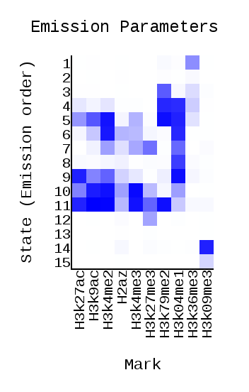
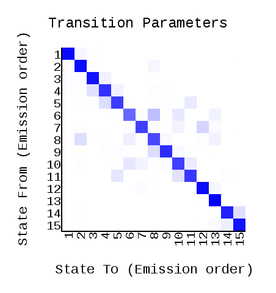
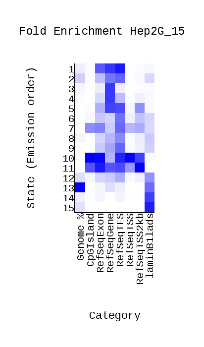
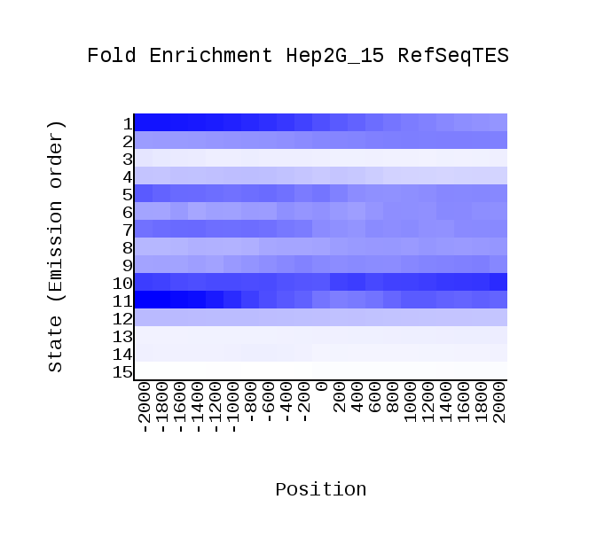

# hse_hw3_chromhmm1

**Гистоновы метки(назвние файла - гистоновая метка):**

wgEncodeBroadHistoneHepg2H2azStdAlnRep1.bam - H2az

wgEncodeBroadHistoneHepg2H3k27acStdAlnRep1.bam - H3k27ac

wgEncodeBroadHistoneHepg2H3k27me3StdAlnRep1.bam - H3k27me3

wgEncodeBroadHistoneHepg2H3k36me3StdAlnRep1.bam - H3k36me3

wgEncodeBroadHistoneHepg2H3k04me1StdAlnRep1.bam - H3k04me1

wgEncodeBroadHistoneHepg2H3k4me2StdAlnRep1.bam - H3k4me2

wgEncodeBroadHistoneHepg2H3k4me3StdAlnRep1.bam - H3k4me3

wgEncodeBroadHistoneHepg2H3k79me2StdAlnRep1.bam - H3k79me2

wgEncodeBroadHistoneHepg2H3k9acStdAlnRep1.bam - H3k9ac

wgEncodeBroadHistoneHepg2H3k09me3AlnRep1.bam - H3k09me3

**cellmarkfiletable.txt**

**ChromHMM**

**Эпигенетические типы**

